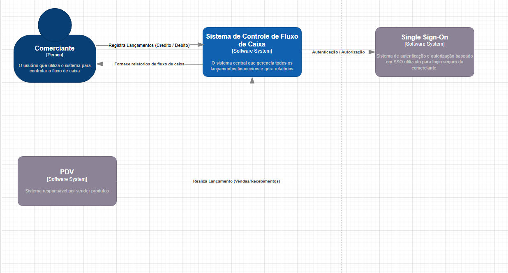
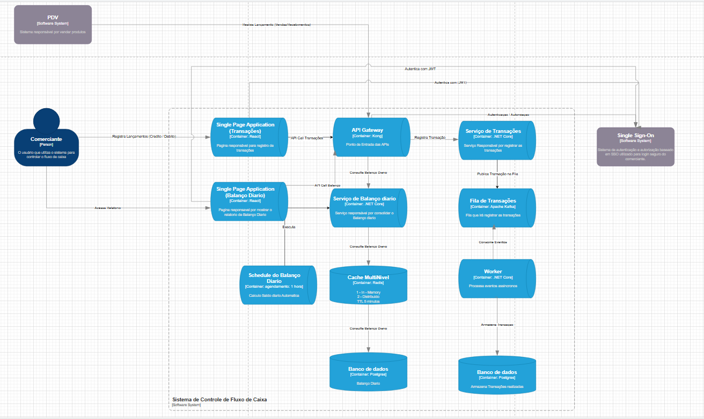

# CashFlow API

Sistema de microserviços para gerenciamento de transações financeiras, desenvolvido com arquitetura distribuída, autenticação centralizada e processamento assíncrono.

## Objetivo do Projeto

O CashFlow tem como objetivo principal registrar e processar transações financeiras de forma eficiente, escalável e segura. A plataforma:

- Registra transações financeiras (créditos e débitos) com data, valor, descrição e origem
- Processa transações de forma assíncrona utilizando Apache Kafka
- Calcula saldos diários a partir das transações processadas
- Implementa autenticação centralizada com Keycloak (OpenID Connect)
- Utiliza API Gateway (Kong) para roteamento e segurança
- Disponibiliza documentação interativa das APIs via Swagger UI
- Interface de usuário intuitiva desenvolvida com React e Material UI

## Diagramas do Sistema

### Diagrama de Contexto C4


### Diagrama de Container C4


## Executando com Docker

### Pré-requisitos
- Docker
- Docker Compose

### Configuração
1. Clone o repositório
2. Execute o sistema completo com Docker Compose:
   ```bash
   docker-compose up -d
   ```

### Acessando os Serviços

- **API Gateway**: http://localhost:8000
- **Frontend**: http://localhost:80
- **Swagger UI**: http://localhost:8000/api/docs
- **Keycloak**: http://localhost:8890
  - Realm: cashflow
  - Usuário padrão: cashflow-user / password
  - Usuário admin: admin / admin
- **Konga** (Admin do Kong): http://localhost:1337
- **Kafka UI**: http://localhost:8080

## Arquitetura

O CashFlow é composto pelos seguintes microserviços:

- **API Gateway (Kong)**: Responsável pelo roteamento, autenticação e autorização das requisições
- **Autenticação (Keycloak)**: Gerenciamento centralizado de identidade e acesso
- **Transaction Service**: Registra e gerencia transações financeiras
- **DailyBalance Service**: Calcula e disponibiliza saldos diários
- **Frontend**: Interface de usuário desenvolvida com React, TypeScript e Material UI
- **Mensageria (Kafka)**: Processamento assíncrono de transações e comunicação entre serviços

### Fluxo de Dados

1. Usuário interage com o Frontend para acessar o sistema
2. Usuário se autentica via Keycloak e obtém um token JWT
3. Requisições para as APIs passam pelo Kong, que valida o token e roteia para o serviço apropriado
4. Transações são registradas no Transaction Service e publicadas no Kafka
5. DailyBalance Service consome as transações do Kafka e calcula os saldos diários
6. Frontend exibe os resultados das operações de forma amigável ao usuário
7. Todas as operações são protegidas por autenticação JWT

## Repositórios

O projeto está organizado nos seguintes repositórios no GitHub:

- **Transaction Service**: [andrarajo/cashflow-transaction](https://github.com/AndrArajo/CashFlowTransactions)
- **DailyBalance Service**: [andrarajo/cashflow-dailybalance](https://github.com/AndrArajo/CashFlowDailyBalance)
- **Frontend**: [andrarajo/cashflow-frontend](https://github.com/AndrArajo/CashFlowFrontEnd)

## Autenticação

O sistema utiliza OAuth 2.0/OpenID Connect via Keycloak. Para obter um token:

```
POST http://localhost:8000/api/v1/token
Content-Type: application/x-www-form-urlencoded

client_id=kong&client_secret=kong-client-secret&grant_type=password&username=cashflow-user&password=password
```

Para utilizar o token nas requisições:

```
GET http://localhost:8000/api/v1/transaction
Authorization: Bearer {seu-token-aqui}
```

## Componentes Principais

- **Kong**: API Gateway para roteamento e segurança
- **Keycloak**: Servidor de autenticação e autorização
- **PostgreSQL**: Banco de dados relacional
- **Kafka**: Sistema de mensageria para processamento assíncrono
- **Redis**: Cache distribuído
- **Swagger UI**: Documentação interativa das APIs
- **React**: Biblioteca para desenvolvimento do frontend
- **Material UI**: Framework de componentes para interface de usuário

## Frontend

O CashFlow Frontend oferece uma interface de usuário intuitiva para:

- Visualizar e gerenciar transações financeiras
- Acompanhar balanços diários
- Analisar o fluxo de caixa por períodos
- Interface responsiva que funciona em dispositivos móveis e desktop
- Autenticação integrada com o Keycloak

## Parando os Serviços

Para parar todos os serviços:
```bash
docker-compose down
```

Para limpar volumes e reiniciar do zero:
```bash
docker-compose down -v
```

## Solução de Problemas

### Keycloak não inicia corretamente
Se o Keycloak apresentar erro de inicialização ou não for possível conectar, tente:

1. Reiniciar apenas o Keycloak:
   ```bash
   docker-compose restart keycloak
   ```

2. Verificar os logs:
   ```bash
   docker-compose logs keycloak
   ```

3. Aguardar mais tempo para inicialização completa e tentar novamente:
   ```powershell
   Start-Sleep -Seconds 60
   .\scripts\setup-keycloak.ps1
   ```

### Alterações na configuração do Kong
Se você fizer alterações no arquivo kong.yml, é necessário reiniciar o serviço Kong para aplicá-las:

```bash
docker-compose restart kong
```

Em seguida, verifique os logs para confirmar que não há erros:

```bash
docker-compose logs kong
```

### Problemas de Autenticação
Se estiver tendo problemas com a autenticação JWT:

1. Verifique se o token não expirou (validade padrão: 24 horas)
2. Tente obter um novo token de acesso
3. Verifique os logs do Kong para mensagens de erro
4. Certifique-se de que o token está sendo enviado corretamente no formato:
   ```
   Authorization: Bearer <token>
   ``` 