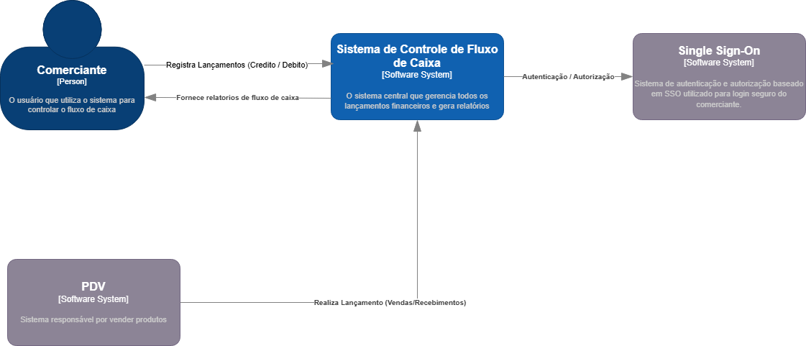
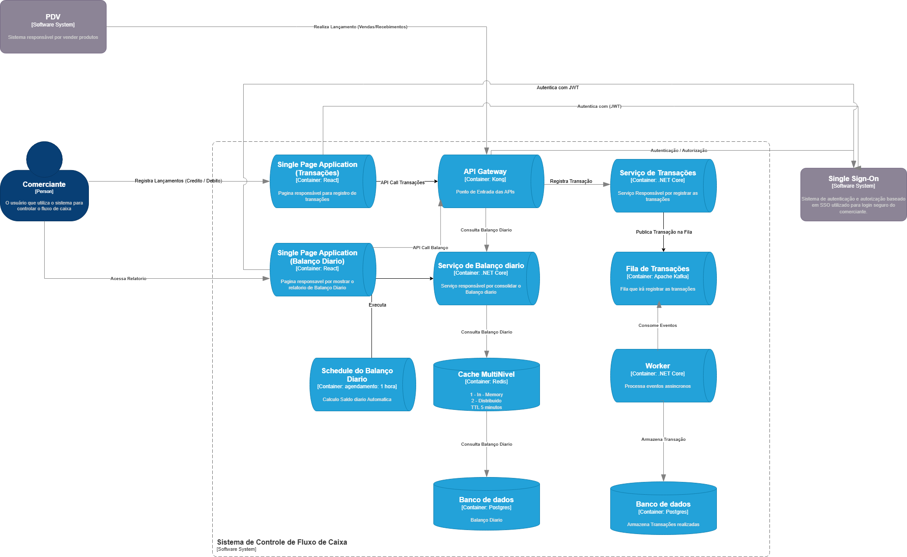

# CashFlow API

Sistema baseado em arquitetura orientada a eventos para gerenciamento de transações financeiras, desenvolvido com comunicação assíncrona, autenticação centralizada e processamento baseado em eventos.

## Requisito Inicial

Um comerciante precisa controlar o seu fluxo de caixa diário com os lançamentos (débitos e créditos), também precisa de um relatório que disponibilize o saldo diário consolidado.

### Requisitos de Negócio Iniciais
- Serviço que faça o controle de lançamentos
- Serviço do consolidado diário

### Requisitos Não Funcionais Iniciais
- O serviço de controle de lançamento não deve ficar indisponível se o sistema de consolidado diário cair
- Em dias de picos, o serviço de consolidado diário recebe 50 requisições por segundo, com no máximo 5% de perda de requisições

## Refinamento dos Requisitos

### Requisitos Funcionais

#### Serviço de Transações (Controle de Lançamentos)
1. **Cadastro de Transações**
   - Registrar transações financeiras (créditos ou débitos)
   - Cada transação deve conter: data, valor, tipo (crédito/débito), descrição e origem
   - Validar dados de entrada (valores negativos apenas para débitos, data não futura, etc.)

2. **Consulta de Transações**
   - Buscar transações por ID
   - Consultar transações de forma paginada

3. **Publicação de Eventos**
   - Publicar eventos para cada nova transação registrada

#### Serviço de Saldo Diário (Consolidado Diário)
1. **Processamento de Saldos**
   - Calcular saldo diário com base nas transações recebidas
   - Processar automaticamente o saldo quando novas transações são registradas
   - Permitir processamento manual de saldo para uma data específica
   - Processar saldo com intervalo de 1 hora

2. **Consulta de Saldos**
   - Consultar saldo de uma data específica
   - Listar saldos de um período 
   - Gerar relatório consolidado de saldos

### Requisitos Não Funcionais

#### Disponibilidade e Resiliência
1. **Alta Disponibilidade**
   - Serviço de Transações deve ter disponibilidade de 90%
   - Falhas no Serviço de Saldo Diário não devem impactar o Serviço de Transações
   - Implementar circuit breaker para lidar com falhas de serviços dependentes

2. **Escalabilidade**
   - Serviço de Saldo Diário deve suportar picos de 50 requisições por segundo
   - Taxa máxima de perda de requisições de 5% em momentos de pico
   - Capacidade de escalar horizontalmente conforme aumenta a demanda

#### Performance
1. **Tempo de Resposta**
   - Registro de transações: tempo de resposta médio < 500ms
   - Consulta de transações: tempo de resposta médio < 700ms
   - Consulta de saldo diário: tempo de resposta médio < 500ms
   - Geração de relatórios: tempo de processamento < 1 segundos

2. **Throughput**
   - Serviço de Transações: capacidade mínima de 100 transações por segundo
   - Serviço de Saldo Diário: processamento mínimo de 50 consolidações por segundo

#### Segurança
1. **Autenticação e Autorização**
   - Autenticação obrigatória para todas as operações
   - Tokens JWT com tempo de expiração configurável

2. **Proteção de Dados**
   - Registro de auditoria (audit logs) para todas as operações
   - Validação de entradas para prevenir injeções e outros ataques
   - Dados sensíveis armazenados com criptografia adequada


## Objetivo do Projeto

O CashFlow tem como objetivo principal registrar e processar transações financeiras de forma eficiente, escalável e segura. A plataforma:

- Registra transações financeiras (créditos e débitos) com data, valor, descrição e origem
- Processa transações de forma assíncrona utilizando Apache Kafka
- Calcula saldos diários a partir das transações processadas
- Implementa autenticação centralizada com Keycloak (OpenID Connect)
- Utiliza API Gateway (Kong) para roteamento e segurança
- Disponibiliza documentação interativa das APIs via Swagger UI
- Interface de usuário intuitiva desenvolvida com React e Material UI

## Diagramas do Sistema

### Diagrama de Contexto C4


### Diagrama de Container C4


## Executando com Docker

### Pré-requisitos
- Docker
- Docker Compose

### Configuração
1. Clone o repositório
2. Copie o arquivo env.example para .env e ajuste as variáveis de ambiente conforme necessário:
   ```bash
   cp env.example .env
   ```
3. Execute o sistema completo com Docker Compose:
   ```bash
   docker-compose up -d
   ```

### Variáveis de Ambiente

O arquivo `.env` permite configurar vários aspectos do sistema. As principais configurações são:

- **Banco de Dados**:
  - `POSTGRES_USER`: Usuário do PostgreSQL (padrão: postgres)
  - `POSTGRES_PASSWORD`: Senha do PostgreSQL (padrão: postgres)
  - `POSTGRES_DB`: Nome do banco de dados (padrão: cashflow)

- **Kafka**:
  - `KAFKA_TOPIC`: Nome do tópico para transações (padrão: transactions)
  - `KAFKA_GROUP_ID`: ID do grupo de consumidores (padrão: transaction-consumer-group)

- **Redis**:
  - `REDIS_PASSWORD`: Senha do Redis (padrão: redis)

- **Frontend**:
  - `REACT_APP_API_URL`: URL da API (padrão: http://localhost:8000/api/v1)
  - `REACT_APP_USE_MOCKS`: Usar dados mockados (padrão: false)

- **Keycloak**:
  - `KEYCLOAK_ADMIN`: Usuário admin do Keycloak (padrão: admin)
  - `KEYCLOAK_ADMIN_PASSWORD`: Senha do admin (padrão: admin)

### Acessando os Serviços

- **API Gateway**: http://localhost:8000
- **Frontend**: http://localhost:8081
- **Swagger UI**: http://localhost:8000/api/docs
- **Keycloak**: http://localhost:8890
  - Realm: cashflow
  - Usuário padrão: cashflow-user / password
  - Usuário admin: admin / admin
- **Konga** (Admin do Kong): http://localhost:1337
- **Kafka UI**: http://localhost:8080

## Arquitetura

O CashFlow é composto pelos seguintes serviços:

- **API Gateway (Kong)**: Responsável pelo roteamento, autenticação e autorização das requisições
- **Autenticação (Keycloak)**: Gerenciamento centralizado de identidade e acesso
- **Transaction Service**: Registra e gerencia transações financeiras
- **DailyBalance Service**: Calcula e disponibiliza saldos diários
- **Frontend**: Interface de usuário desenvolvida com React, TypeScript e Material UI
- **Mensageria (Kafka)**: Processamento assíncrono de transações e comunicação entre serviços

### Fluxo de Dados

1. Usuário interage com o Frontend para acessar o sistema
2. Usuário se autentica via Keycloak e obtém um token JWT
3. Requisições para as APIs passam pelo Kong, que valida o token e roteia para o serviço apropriado
4. Transações são registradas no Transaction Service e publicadas no Kafka
5. DailyBalance Service consome as transações do Kafka e calcula os saldos diários
6. Frontend exibe os resultados das operações de forma amigável ao usuário
7. Todas as operações são protegidas por autenticação JWT

## Repositórios

O projeto está organizado nos seguintes repositórios no GitHub:

- **Transaction Service**: [andrarajo/cashflow-transaction](https://github.com/AndrArajo/CashFlowTransactions)
- **DailyBalance Service**: [andrarajo/cashflow-dailybalance](https://github.com/AndrArajo/CashFlowDailyBalance)
- **Frontend**: [andrarajo/cashflow-frontend](https://github.com/AndrArajo/CashFlowFrontEnd)

## Autenticação

O sistema utiliza OAuth 2.0/OpenID Connect via Keycloak. Para obter um token:

```
POST http://localhost:8000/api/v1/token
Content-Type: application/x-www-form-urlencoded

client_id=kong&client_secret=kong-client-secret&grant_type=password&username=cashflow-user&password=password
```

Para utilizar o token nas requisições:

```
GET http://localhost:8000/api/v1/transaction
Authorization: Bearer {seu-token-aqui}
```

## Componentes Principais

- **Kong**: API Gateway para roteamento e segurança
- **Keycloak**: Servidor de autenticação e autorização
- **PostgreSQL**: Banco de dados relacional
- **Kafka**: Sistema de mensageria para processamento assíncrono
- **Redis**: Cache distribuído
- **Swagger UI**: Documentação interativa das APIs
- **React**: Biblioteca para desenvolvimento do frontend
- **Material UI**: Framework de componentes para interface de usuário

## Frontend

O CashFlow Frontend oferece uma interface de usuário intuitiva para:

- Visualizar e gerenciar transações financeiras
- Acompanhar balanços diários
- Analisar o fluxo de caixa por períodos
- Interface responsiva que funciona em dispositivos móveis e desktop
- Autenticação integrada com o Keycloak

## Justificativa das Tecnologias

O projeto CashFlow utiliza diversas tecnologias modernas, cada uma escolhida por razões específicas:

### Arquitetura Orientada a Eventos (Event-Driven)
A arquitetura orientada a eventos foi adotada pois oferece vantagens significativas para sistemas financeiros:
- Desacoplamento entre produtores e consumidores de eventos
- Processamento assíncrono que melhora a escalabilidade
- Maior resiliência, pois falhas em um componente não afetam diretamente outros
- Facilidade para adicionar novos consumidores sem modificar os produtores
- Possibilidade de reconstrução do estado do sistema através do histórico de eventos
- Permite reagir em tempo real a mudanças de estado (como novas transações)

### Kong (API Gateway)
O Kong foi escolhido como API Gateway por:
- Facilitar o roteamento de requisições para os serviços apropriados
- Centralizar a autenticação e autorização
- Oferecer recursos avançados como rate limiting e transformação de requisições
- Suportar plugins para expandir funcionalidades
- Ter baixo overhead e alta performance

### Keycloak (Autenticação)
O Keycloak foi adotado para gerenciamento de identidade e acesso porque:
- Implementa os padrões OAuth 2.0 e OpenID Connect
- Oferece recursos de SSO (Single Sign-On)
- Permite integração com diversos provedores de identidade
- Inclui gerenciamento de usuários e permissões
- É altamente configurável e extensível

### Kafka (Mensageria)
O Apache Kafka foi escolhido para comunicação assíncrona entre serviços porque:
- É o backbone ideal para arquiteturas orientadas a eventos
- Oferece alta capacidade de processamento e baixa latência
- Garante durabilidade de mensagens mesmo em caso de falhas
- Suporta replicação para alta disponibilidade
- Mantém a ordem dos eventos dentro de cada partição

### PostgreSQL (Banco de Dados)
O PostgreSQL foi adotado como banco de dados porque:
- Tem boa performance para workloads transacionais
- É confiável e maduro, com suporte a transações ACID


### Redis (Cache)
O Redis foi escolhido para cache distribuído porque:
- Oferece armazenamento em memória de alta performance
- Permite configuração de expiração de chaves
- É escalável e pode ser configurado para alta disponibilidade
- Reduz a carga no banco de dados principal

### React e Material UI (Frontend)
O React e Material UI foram adotados para o frontend porque:
- O React oferece desenvolvimento baseado em componentes para melhor reutilização
- O virtual DOM do React proporciona melhor performance na renderização
- Material UI fornece componentes pré-construídos com design moderno
- Ambos possuem grande ecossistema e suporte da comunidade
- Facilitam o desenvolvimento de interfaces responsivas

### Docker e Docker Compose (Containerização)
Docker e Docker Compose foram escolhidos porque:
- Permitem empacotar aplicações e suas dependências de forma consistente
- Facilitam a implantação em diferentes ambientes
- Simplificam a orquestração de múltiplos serviços

## Parando os Serviços

Para parar todos os serviços:
```bash
docker-compose down
```

Para limpar volumes e reiniciar do zero:
```bash
docker-compose down -v
```

## Solução de Problemas

### Keycloak não inicia corretamente
Se o Keycloak apresentar erro de inicialização ou não for possível conectar, tente:

1. Reiniciar apenas o Keycloak:
   ```bash
   docker-compose restart keycloak
   ```

2. Verificar os logs:
   ```bash
   docker-compose logs keycloak
   ```

3. Aguardar mais tempo para inicialização completa e tentar novamente:
   ```powershell
   Start-Sleep -Seconds 60
   .\scripts\setup-keycloak.ps1
   ```

### Alterações na configuração do Kong
Se você fizer alterações no arquivo kong.yml, é necessário reiniciar o serviço Kong para aplicá-las:

```bash
docker-compose restart kong
```

Em seguida, verifique os logs para confirmar que não há erros:

```bash
docker-compose logs kong
```

### Problemas de Autenticação
Se estiver tendo problemas com a autenticação JWT:

1. Verifique se o token não expirou (validade padrão: 24 horas)
2. Tente obter um novo token de acesso
3. Verifique os logs do Kong para mensagens de erro
4. Certifique-se de que o token está sendo enviado corretamente no formato:
   ```
   Authorization: Bearer <token>
   ``` 